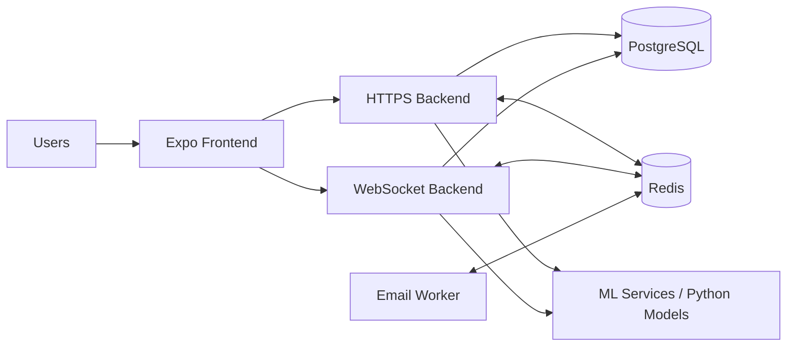

# Sentry App

Sentry App is a multi-service safety and tourism platform. The repository contains a mobile frontend, three backend services, and a Python ML folder used for preprocessing datasets and supporting risk-related features.

## Architecture

The project is organized as a small distributed system:

- The Expo frontend handles the user interface for mobile and web.
- The HTTPS backend provides the main REST API for auth, SOS, contacts, support, stats, booking partners, alerts, and safety zones.
- The WebSocket backend handles realtime updates, admin notifications, and chat-oriented flows.
- The email worker processes queued email jobs through BullMQ and Redis.
- The ML folder contains preprocessing scripts and notebooks that support the safety and risk workflows.



## Repository Layout

- `frontend/` - Expo Router mobile app
- `backend/https-backend/` - REST API for auth, SOS, contacts, stats, booking partners, support, alerts, and safety zones
- `backend/websocket-backend/` - WebSocket service for live admin updates and chat-related realtime features
- `backend/email-worker-backend/` - Dedicated email worker service powered by BullMQ
- `ml/` - Python dependencies for preprocessing and ML workflows
- `src/` - Python preprocessing scripts
- `notebooks/` - Jupyter notebooks for the preprocessing steps

## Prerequisites

- Node.js 18 or newer for the backend services
- npm
- Python 3.10+ for the ML tooling
- Redis for queueing and realtime features
- A PostgreSQL database for Prisma-based services

## Frontend

The frontend lives in `frontend/` and uses Expo Router.

### Install and run

```bash
cd frontend
npm install
npm run start
```

Useful scripts:

- `npm run android`
- `npm run ios`
- `npm run web`
- `npm run lint`

### Frontend environment variables

The Expo config reads these variables from the environment:

- `EXPO_PUBLIC_BACKEND_URL`
- `EXPO_PUBLIC_OPENWEATHER_API_KEY`
- `EXPO_PUBLIC_OPENWEATHER_API_URL`
- `EXPO_PUBLIC_WEATHER_FETCH_TIMEOUT`
- `EXPO_PUBLIC_MAPBOX_ACCESS_TOKEN`
- `EXPO_PUBLIC_MAPBOX_API_URL`
- `EXPO_PUBLIC_DEFAULT_COUNTRY_CODE`
- `EXPO_PUBLIC_DEFAULT_LATITUDE`
- `EXPO_PUBLIC_DEFAULT_LONGITUDE`
- `EXPO_PUBLIC_MAP_FETCH_TIMEOUT`
- `EXPO_PUBLIC_FETCH_TIMEOUT`
- `EXPO_PUBLIC_AWS_RISK_BASE_URL`
- `EXPO_PUBLIC_POLICE_STATION_LOCATION_URL`
- `EXPO_PUBLIC_POLICE_STATION_BOUNDARY_URL`

## HTTPS Backend

The REST API lives in `backend/https-backend/`.

### Install and run

```bash
cd backend/https-backend
npm install
npm run build
npm run start
```

Development mode:

```bash
npm run dev
```

Available scripts:

- `npm run start` - applies Prisma migrations and starts the compiled server
- `npm run dev` - runs the TypeScript entry point with ts-node
- `npm run build` - generates Prisma client, compiles TypeScript, and copies generated sources
- `npm run add-contact` - runs the contact seeding helper

### HTTPS backend environment variables

- `PORT`
- `DATABASE_URL`
- `REDIS_URL` or `REDIS`
- `JWT_SECRET`
- `FROM_EMAIL`
- `FROM_NAME`
- `BREVO_API_KEY`
- `ML_BACKEND_URL`
- `AWS_RISK_BASE_URL` 
- `AWS_RISK_TIMEOUT_MS`

## WebSocket Backend

The realtime backend lives in `backend/websocket-backend/`.

### Install and run

```bash
cd backend/websocket-backend
npm install
npm run build
npm run start
```

Development mode:

```bash
npm run dev
```

Useful scripts:

- `npm run worker` - starts the email worker inside the websocket service process

### WebSocket backend environment variables

- `PORT`
- `DATABASE_URL`
- `REDIS_URL` or `REDIS`
- `JWT_SECRET`
- `RUN_EMAIL_WORKER`
- `GEMINI_API_KEY`
- `GEMINI_MODEL`
- `GEMINI_FALLBACK_MODEL`
- `GEMINI_TIMEOUT_MS`
- `GEMINI_MAX_RETRIES`
- `FROM_EMAIL`
- `FROM_NAME`
- `BREVO_API_KEY`
- `HIGH_RISK_THRESHOLD`
- `CHAT_MAX_QUESTION_LENGTH`
- `ML_BACKEND_URL`

## Email Worker Backend

The standalone email worker lives in `backend/email-worker-backend/`.

### Install and run

```bash
cd backend/email-worker-backend
npm install
npm run build
npm run start
```

Development mode:

```bash
npm run dev
```

### Email worker environment variables

- `PORT`
- `REDIS_URL` or `REDIS`
- `FROM_EMAIL`
- `FROM_NAME`
- `BREVO_API_KEY`

## ML Folder

The `ml/` folder contains the Python dependencies for preprocessing and analysis work used by the project.

### Setup

```bash
cd ml
pip install -r requirements.txt
```

The preprocessing scripts live in `src/`, and the corresponding notebooks are in `notebooks/`.

## Notes

- Prisma-generated files are checked into the backend services, so make sure to run the relevant `build` script after changing schemas.
- The websocket service can optionally start the email worker in-process when `RUN_EMAIL_WORKER=true`.
- The project uses Redis for queues and realtime session/event broadcasting.
